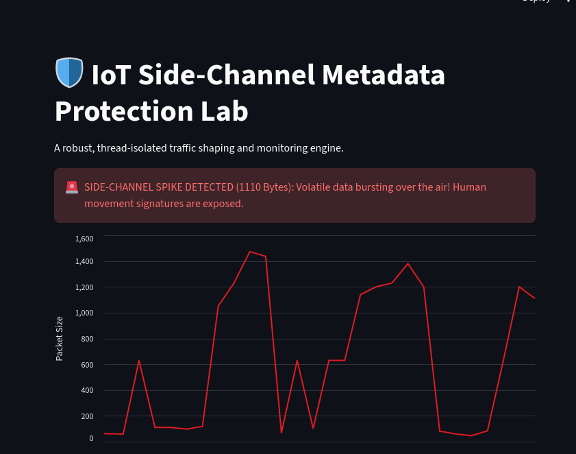
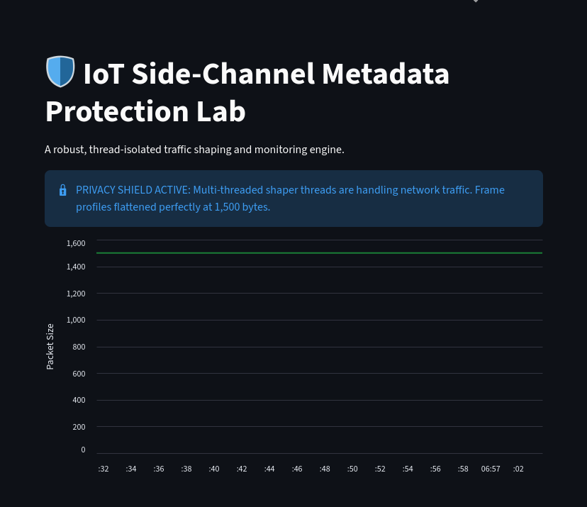
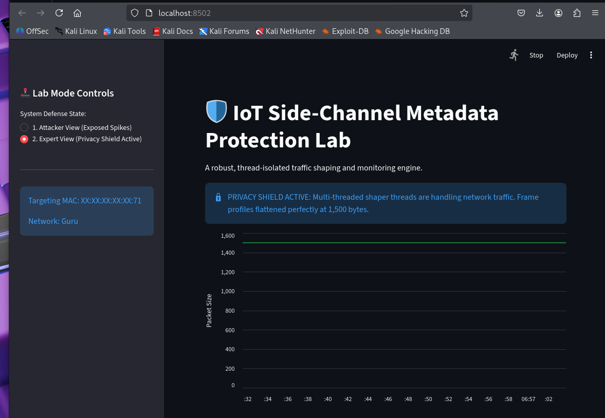

# 🛡️ IoT Privacy Shield: Defending Against Side-Channel Metadata Leaks

A hands-on engineering exploration of **Traffic Side-Channel Analysis (SCA)** and privacy mitigation frameworks in smart home networks. This project demonstrates how an attacker sitting outside a house can map out a resident's physical movements without ever knowing the Wi-Fi password or cracking its encryption keys, and provides an engineering solution to neutralize the threat.

---

## 📡 Part 1: The Attack (The Vulnerability)

Even when 100% of your Wi-Fi payload data is fully encrypted using **WPA2**, or your network SSID is completely hidden, the **size**, **timing**, and **frequency** of wireless data frames pass through physical walls entirely unencrypted. By capturing raw radio packets via a wireless interface operating in monitor mode, an observer can extract metadata and build a behavioral fingerprint of your daily routine.

### 🔍 How it Works:
* **Idle State (Baseline):** A smart camera or IoT device sits quietly in an empty room, sending low-volume `40–120 byte` background keep-alive heartbeats.
* **Active State (The Leak):** A human enters the room or walks past the camera. Even though the resulting video stream layer is securely encrypted, the hardware is forced to upload an instant explosion of massive, full maximum transmission unit (**1500-byte**) frames to handle the raw data surge.
* **The Result:** The attacker logs these massive transmission bursts to trace exact occupancy status, room transitions, and real-time physical movement signatures.

### 🎬 Threat Replication Walkthrough
When running the custom threat analysis dashboard in an unprotected state, the interface catches live telemetry modifications over the air. 

#### 🚨 Case A: Active Side-Channel Burst
When human motion occurs in front of an unshaped target device (`MAC: XX:XX:F2:XX:6E:XX`), traffic scales aggressively, exposing distinct telemetry spikes that shoot all the way up to **1,500 Bytes**.


#### 🟢 Case B: Empty / Idle State
When the target space is vacant, the data flow rests quietly back down to its minimal background noise baseline (`40-120 Bytes`).


---

## 🛠️ Part 2: The Solution (The Prevention)

Because physical radio waves cannot be selectively blocked from traveling through household walls, the only robust architectural mitigation is **Traffic Shaping and Morphic Packet Padding**. 

The solution engine acts as a thread-isolated **Leaky Bucket Queue Buffer** interposed between the network layer and the interface. Instead of allowing the device to transmit variable data packets in volatile, real-time spikes, our defense core enforces a strict, hardware-timed stream of **Morphic Dummy Chaff Data**.


Encrypted IoT Communication
             │
             ▼
      ┌──────────────┐
      │   Payload    │
      │   Encrypted  │
      └──────────────┘
             │
             │
      Observable Metadata
             │
      ┌──────┼──────┐
      ▼      ▼      ▼
    Size   Timing  Frequency
             │
             ▼
       Traffic Pattern
             │
             ▼
    Potential Side-Channel
             │
             ▼
[ 🛡️ IoT-PrivacyShield Engine ] ──► (Injects Morphic Chaff / Padding)
             │
             ▼
   Normalized 1500B Flat-Line 


### 🔒 The Result:
To an adversary eavesdropping outside, the network traffic signature is transformed into an unyielding, flat line of uniform 1,500-byte packets matching exactly the peak MTU capacity. The human presence fingerprint is entirely erased from the airwaves.



---

## 💻 Directory Structure

This project maintains clean isolation between source applications, automation environments, and parsed capture logs:

```text
├── dashboard.py   # Streamlit threat visualization dashboard
├── assets/
│   ├── image_0QJnul.png      # Active burst screenshot
│   ├── image_DXktEx.png      # Idle state screenshot
│   └── image_yIF56d.png      # Shield active flatline screenshot
├── mock_burst.py             # Automatic traffic dataset simulator
└── requirements.txt          # Python application dependencies
```

---

## 🚀 Deployment & Replication Guide

### 🦾 Step 1: Wireless Reconnaissance (Monitor Mode)
Transition your wireless network interface card into a monitoring workspace to parse raw 802.11 frame parameters:

```bash
# 1. Clear conflicting wireless networking processes
sudo airmon-ng check kill

# 2. Initialize monitor mode on your adapter interface
sudo airmon-ng start wlan0

# 3. Scan the radio spectrum for the target router's BSSID and Channel
sudo airodump-ng wlan0mon[ check your device by iwconfig command. check is it wlan0 or wlan0mon ]

# 4. Lock your interface onto the target router's channel and track active station MAC addresses
sudo airodump-ng -c <CHANNEL> --bssid <ROUTER_MAC> wlan0mon
```

### 🖥️ Step 2: Laboratory Environment Setup
Open a separate terminal shell within your Kali environment to set up dependencies and deploy the Streamlit visualization system:

```bash
# 1. Refresh system package repositories
sudo apt update

# 2. Install Python environment managers and packet core utilities
sudo apt install python3-pip python3-venv tshark -y

# 3. Create a clean virtual environment workspace
python3 -m venv venv
source venv/bin/activate

# 4. Install necessary libraries
pip install streamlit pandas matplotlib numpy
```

### 🔬 Step 3: Launching the Lab Engine
To run the full simulation suite cleanly, split your terminal workspace into two windows:

1. **Terminal A (Run the Simulation Core):** Launch the automatic data simulator script to generate background heartbeats and active motion bursts inside the capture log ( if you want to capture and see real data use the airodump-ng and use the step1 instructions which will help to generate the live_traffic-01.csv and then run the dashboard.py):

   ```bash
   python mock_burst.py
   ```
2. **Terminal B (Launch the Protection Lab UI):** Deploy the main Streamlit framework to track live network changes:
   ```bash
   streamlit run dashboard.py
   ```

*Open your web browser interface to `http://localhost:8502`. Use the sidebar control to toggle between **Attacker View** to observe raw metadata exposure peaks and **Expert View** to watch the multi-threaded defense module dynamically enforce a secure, invariant green flatline.*

---

## 📊 Evaluation Metrics & Structural Trade-offs

| System State | Traffic Volatility | Threat Tracking Viability | Bandwidth Cost |
| :--- | :--- | :--- | :--- |
| **Standard Encrypted (Unprotected)** | 🚨 High (Unstable Bursts) | 🔴 **Vulnerable** (Pattern extraction easy) | 🟢 Minimal (On-demand) |
| **Privacy Shield Enforced (Protected)** | 🟢 Zero (Immutable CBR) | 🛡️ **Secure** (Metadata fully masked) | 🔴 Elevated (Continuous padding) |

---

## 📜 License
Distributed under the **MIT License**. See `LICENSE` for details.


